# Interesting facts about Adelaide city

## Varun Khanna
## 29 July 2018

### **Acknowledgement**: All the data is derived from [Data.SA](https://data.sa.gov.au/data/dataset/adelaide-city-living-market-research)

------------------------------------------------------------------------
Visit the [adelaideCity project](https://rpubs.com/imvarun9/adelaideCity) page.
------------------------------------------------------------------------

``` r
knitr::opts_chunk$set(fig.width = 10, fig.height = 7, fig.path = 'Figs/', warning = FALSE, message = FALSE)
```

``` r
# Load the packages
library("XLConnect")
library("tidyverse")
```

``` r
# Load and read the excel file
adelaide <- loadWorkbook("adelaide-metropolitan-market-survey-data.xlsx")
# Read the first sheet
segment <- readWorksheet(adelaide, sheet = "Tables_Original", startRow = 15, endRow = 19, startCol = 1, endCol = 8, header = FALSE)
# Read the city worker status
cityWorker <- readWorksheet(adelaide, sheet = "Tables_Original", startRow = 15, endRow = 19, startCol = 14, endCol = 16, header = FALSE)
```

``` r
# Prepare the data
# Prepare the name vector
name <- c("Total", "Cosmopolitans", "Homebodies", "Traditionalists","Urbanites", "Suburbanites", "Diffidents", "North","East","South","West","Central","travel_to_city","travel_elsewhere","no_travel")
# Assign the names
names(segment) <- c("location",name[1:7])
# Remove the central location because data is sparse
segment <- segment[-5,]
# Remove the percentage sign 
segment$Traditionalists <- as.numeric(sub("%","",segment$Traditionalists, fixed = TRUE))/100

# Assign names to cityworker df 
names(cityWorker) <- name[13:15]
# Remove central location form city worker df
cityWorker <- cityWorker[-5,] 
# Combine cityWorkers with locations in sgement
cityWorker <- cbind(location = segment[,1], cityWorker)

# Convert the segment data into long format
segmentLong <- gather(segment, key = segment, value = num, c(-location, -Total))
# Convet the cityWorker data to long format 
cityWorker <- gather(cityWorker, key = travelStatus, value = percent, c(-location))
```

1. What type of  live in Adelaide?

``` r
ggplot(segmentLong, mapping = aes(x = location, y = num)) + geom_bar(stat = "identity") + facet_wrap( ~ segment) + labs( x = "Location", y = "Percentage of residents", title = "Adelaide dwelling pattern") + scale_y_continuous(labels = scales::percent)
```

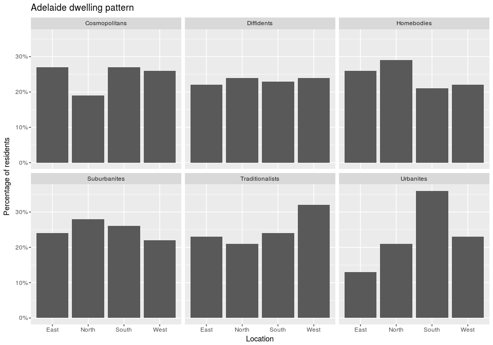

#### Read about the type of people [here](/images/social/adelaide.pdf)

Insights:
---------

#### 1. **Cosmopolitians** are less likely to live in North whereas **Homebodies** and **Suburbanities** prefer to live in Northern suburbs of Adelaide.

#### 2. **Diffidents** are distribuited evenly throughout the city.

#### 3. **Urbanities** prefer to live in South while **Traditionalists** prefer West suburbs.

------------------------------------------------------------------------

2.  worker status

``` r
ggplot(cityWorker, mapping = aes(x = location, y = percent, fill = travelStatus)) + geom_bar(stat = "identity", position = position_dodge()) + scale_fill_brewer(palette="Dark2", name = "Travel status", labels = c("No travel", "Travel elsewhere", "Travel to city")) + theme_minimal() + labs(x = "Location", y = "Percentage of residents", title = "Travel status of the residents of Adelaide city") + scale_y_continuous(labels = scales::percent)
```

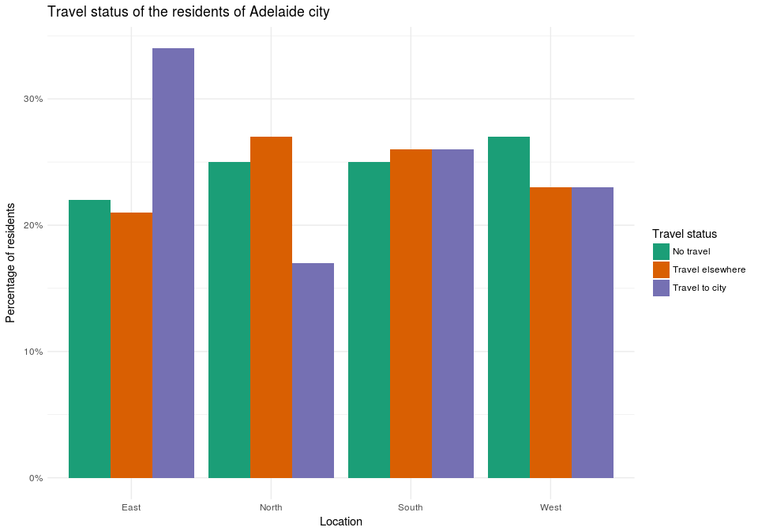

Insights:
---------

#### 1. There is a **sharp contrast between residents of East and North**. Maximum number of people living in the East travel to city for work while most people in the North travel elsewhere and only a small portion travel to city for work.

#### 2. About a quater % of people living in the West do not travel for work.

------------------------------------------------------------------------

3.  location wise

``` r
gender <- readWorksheet(adelaide, sheet = "Tables_Original", startRow = 35, endRow = 36, startCol = 1, endCol = 12, header=FALSE)
names(gender) <- c("Gender",name[1:11])
# Convert the data
gender_loc <- (gender[,c(1,9:12)])
gender_loc <- gather(gender_loc, key = location, value = percent, -Gender)
ggplot(gender_loc, mapping = aes(x = location, y = percent, fill = Gender)) + geom_bar(stat = "identity") + scale_fill_manual(values=c('#999999','#E69F00')) + labs(x = "Location", y = "Percentage of residents") + scale_y_continuous(labels = scales::percent) + theme_minimal()
```

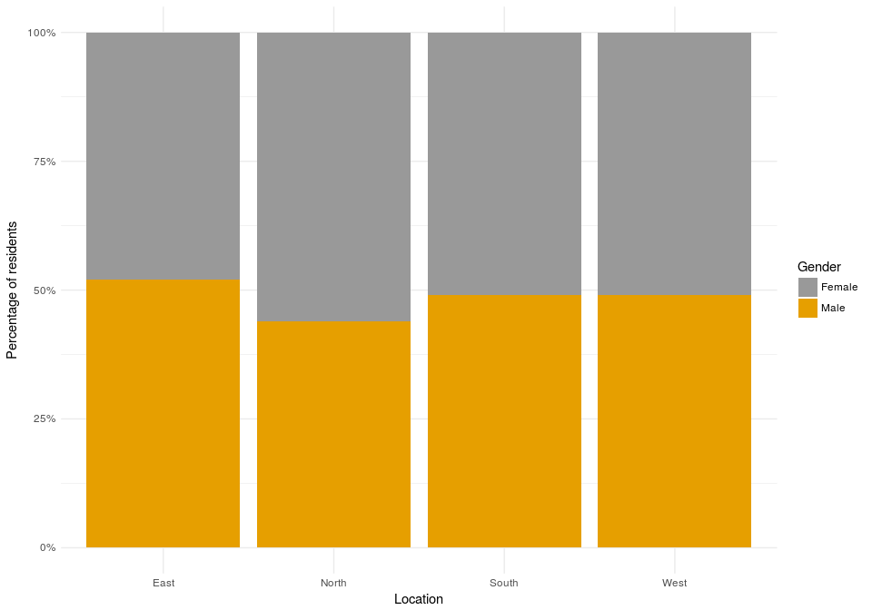

Insights:
---------

#### 1. Seems like **perfect Gender balance** in all the suburbs except North where there are more females than males.

------------------------------------------------------------------------

4.  segment wise

``` r
gender_seg<- (gender[,c(1,3:8)])
gender_seg<- gather(gender_seg, key = segment, value = percent, -Gender)
ggplot(gender_seg, mapping = aes(x = segment, y = percent, fill = Gender)) + geom_bar(stat = "identity") + scale_fill_manual(values=c('#999999','#E69F00')) + labs(x = "Segment", y = "Percentage of residents")  + scale_y_continuous(labels = scales::percent) + theme_minimal()
```

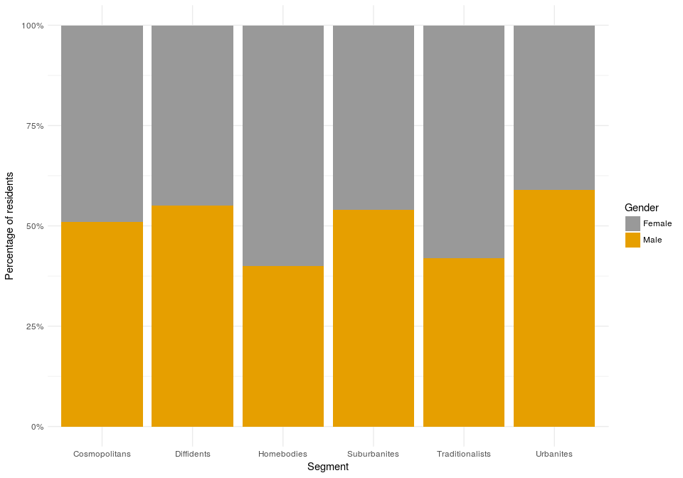

Insights:
---------

#### 1. Male dominated **Diffidents, Suburbanities and Urbanities**.

#### 2. Female dominated **Homebodies and Traditionalists**.

------------------------------------------------------------------------

5.  distribution of Adelaide residents

``` r
age <- readWorksheet(adelaide, sheet = "Tables_Original", startRow = 52, endRow = 63, startCol = 1, endCol = 12, header=FALSE)
names(age) <- c("age",name[1:11])
age$age<- str_replace_all(age$age," ","-")
age_loc <- age[,c(1,9:12)]
age_loc <- gather(age_loc, key = location, value = percent, -age)
age_loc$location<- factor(age_loc$location, levels=c("East","West","North","South"))
ggplot(age_loc, mapping = aes(x = age, y = percent, fill = percent)) + geom_bar(stat = "identity") + facet_wrap( ~ location) + coord_polar() +
  theme(axis.text.x = element_text(angle=-20, hjust = 1, size = 8), axis.text.y = element_blank(), axis.title = element_blank(), axis.ticks = element_blank()) + scale_fill_continuous( name = "Percentage of residents", labels = scales::percent)
```

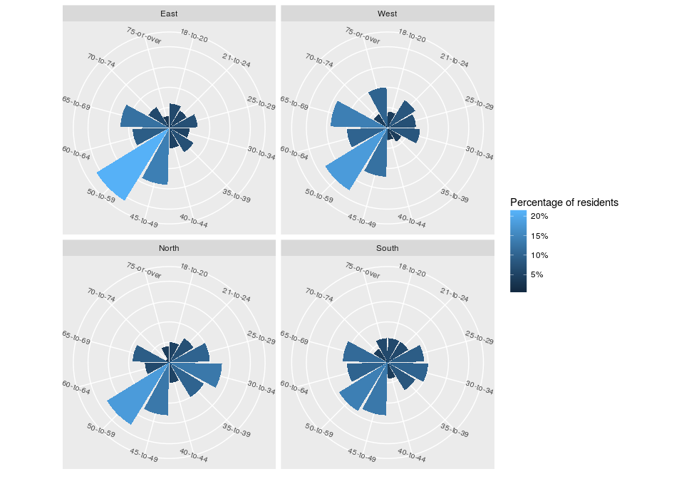

Insights:
---------

#### 1. Most **dominant agegroup** in Adelaide **50-to-59**.

#### 2. Most number of people **above 75 live in West** as compared to other areas.

#### 3. **North and South** also have quite large percentage of people from **25-to-39** agegroup.

------------------------------------------------------------------------

6. City worker status and age of the residents

``` r
age_work <- readWorksheet(adelaide, sheet = "Tables_Original", startRow = 52, endRow = 63, startCol = 14, endCol = 16, header=FALSE)
age_work <- cbind(age=age$age, age_work)
names(age_work) <- c("age",name[13:15])
age_work <- gather(age_work, key = travel_status,value = percent , -age )
ggplot(age_work, mapping = aes(x = age, y = percent *100, fill = travel_status)) + geom_bar(stat = "identity") + coord_flip() + scale_fill_manual(values=c('#999999','#E69F00', '#56B4E9'), name = "Travel Status", labels = c("No travel", "Travel elsewhere", "Travel to city")) + labs(y = "Percentage of residents", x = "Age") + theme_minimal()
```

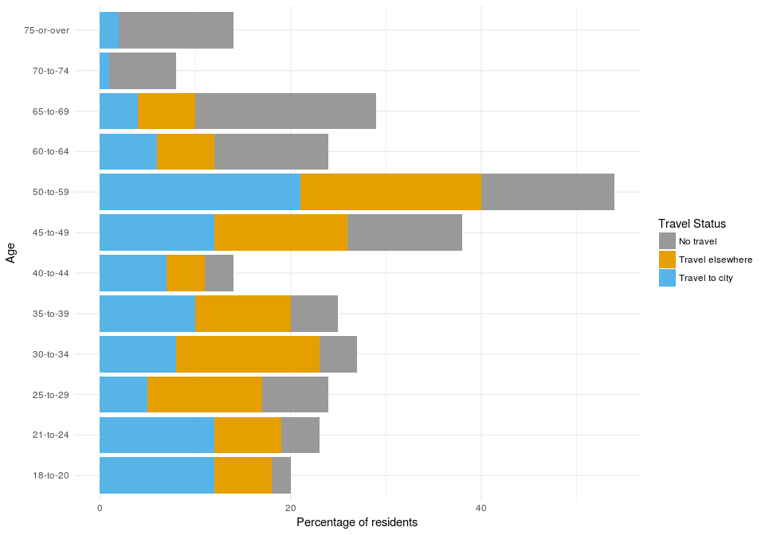

------------------------------------------------------------------------

7. Main method of 

``` r
transport <- readWorksheet(adelaide, sheet = "Tables_Original", startRow = 80, endRow = 85, startCol = 1, endCol = 12, header=FALSE)
names(transport) <- c("method",name[1:11])
# Remove % sign
transport<- as.data.frame(sapply(transport, function(x) str_replace(x, "%","")), stringsAsFactors = F)
# Replace - with 0
transport<- as.data.frame(sapply(transport, function(x) str_replace(x, "- ","0")), stringsAsFactors = F)
# Get the location data 
transport_loc <- transport[,c(1,9:12)]
# Convert the columns into numeric
transport_loc$North <- as.numeric(transport_loc$North) / 100
transport_loc$East <- as.numeric(transport_loc$East)
transport_loc$South <- as.numeric(transport_loc$South) / 100
transport_loc$West <- as.numeric(transport_loc$West) / 100
transport_loc <- gather(transport_loc, key = "loc", value = "percent", -c(method))
transport_loc$loc<- factor(transport_loc$loc, levels=c("East","West","North","South"))

ggplot(transport_loc, mapping = aes(x = method, y = percent)) + geom_bar(stat = "identity") + facet_wrap(~loc) + scale_x_discrete(labels = c("Car","Motarbike","Other","Public transport", "Pushbike","Walk")) + theme(axis.text.x = element_text(angle = 90)) + labs(x = "Method of transport", y = "Percentage of residents") + scale_y_continuous(labels = scales::percent)
```

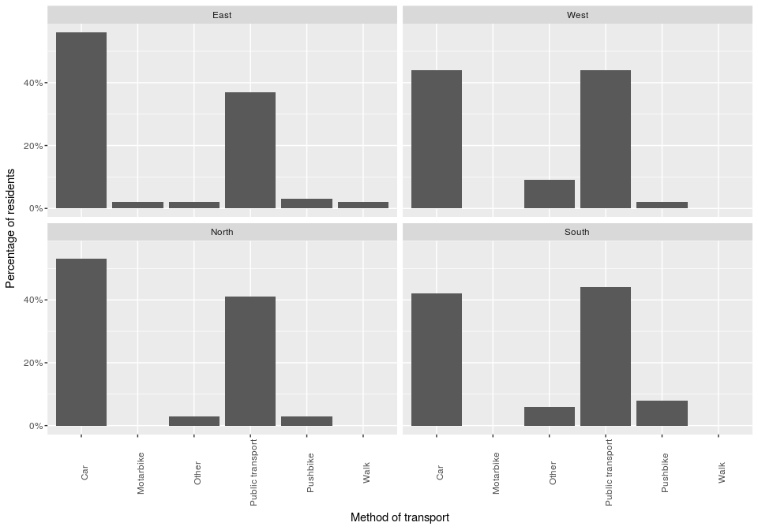

Insights:
---------

#### 1. **Car and Public transport** are clearly most favourite mode of transport of the residents of Adelaide.

#### 2. Car in the preferred over public transport in East and North.

------------------------------------------------------------------------

8. Approximate total time spent during traveling to work or study?

``` r
time <- readWorksheet(adelaide, sheet = "Tables_Original", startRow = 101, endRow = 106, startCol = 1, endCol = 12, header=FALSE)
# Assign names
names(time) <- c("minutes",name[1:11])
time_loc <- time[,c(1,9:12)]
time_loc$minutes <- c("<20","20-to-40","40-to-60","60-to-80","80-to-100",">100")
time_loc <- gather(time_loc, key = "loc", value = "percent", -minutes)
time_loc$loc <- factor(time_loc$loc, levels=c("East","West","North","South"))

time_loc$minutes <- factor(time_loc$minutes, levels = c("<20","20-to-40","40-to-60","60-to-80","80-to-100",">100"))

ggplot(time_loc, mapping = aes(x = minutes, y = percent, fill = loc)) + geom_bar(stat = "identity",position = "dodge") + theme(axis.text.x = element_text(angle = 90)) + labs(x = " Commuting time in minutes", y = "Percentage of residents") + scale_y_continuous(labels = scales::percent) + scale_fill_manual(values=c('#CC6699','#E69F00', '#56B4E9', "#654B9E"), name = "Location")
```

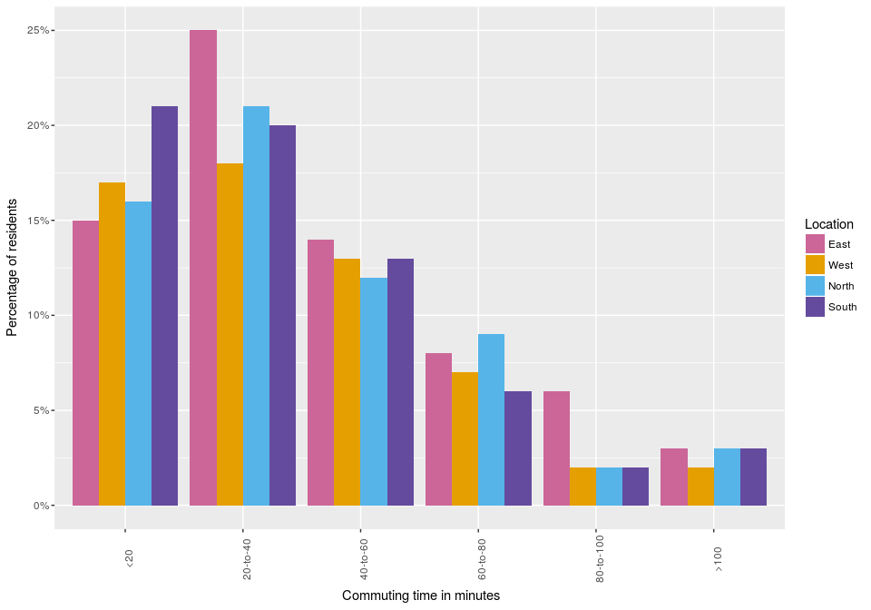

------------------------------------------------------------------------

9.  ownership.

``` r
ownership <- readWorksheet(adelaide, sheet = "Tables_Original", startRow = 1798, endRow = 1801, startCol = 1, endCol = 12, header=FALSE)
names(ownership) <- c("ownership",name[1:11])
ownership$ownership <- c("Own","Mortgage","Rent", "Other")
ownership_loc <- ownership[,c(1,9:12)]
ownership_loc <- gather(ownership_loc, key = "loc", value = "percent", -ownership)
ownership_loc$loc <- factor(ownership_loc$loc, levels=c("East","West","North","South"))
ownership_loc$ownership <- factor(ownership_loc$ownership, levels=c("Own","Mortgage","Rent","Other"))
ggplot(ownership_loc, mapping = aes(x = ownership, y = percent, fill = loc)) + geom_bar(stat = "identity",position = "dodge") + labs(x = "Ownership", y = "Percentage of residents") + scale_y_continuous(labels = scales::percent) + scale_fill_manual(values=c('#CC6699','#E69F00', '#56B4E9', "#654B9E"), name = "Location") + theme_minimal()
```

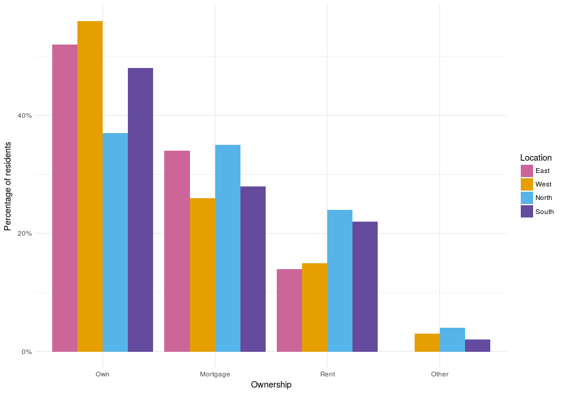

------------------------------------------------------------------------

10. Estimated value of the current .

``` r
value <- readWorksheet(adelaide, sheet = "Tables_Original", startRow = 1817, endRow = 1827, startCol = 1, endCol = 12, header=FALSE)
names(value) <- c("value",name[1:11])
value_loc <- value[,c(1,9:12)]
# Remove % sign
value_loc <- as.data.frame(sapply(value_loc, function(x) str_replace(x, "%","")), stringsAsFactors = F)
# Replace - with 0
value_loc <- as.data.frame(sapply(value_loc, function(x) str_replace(x, "- ","0")), stringsAsFactors = F)
# Convert the columns into numeric
value_loc$North <- as.numeric(value_loc$North)
value_loc$East <- as.numeric(value_loc$East)/ 100
value_loc$South <- as.numeric(value_loc$South)
value_loc$West <- as.numeric(value_loc$West) / 100

value_loc <- gather(value_loc, key = "loc", value = "percent", -c(value))
value_loc$loc <- factor(value_loc$loc, levels=c("East","West","North","South"))

ggplot(value_loc, mapping = aes(x = value, y = percent, fill = loc)) + geom_bar(stat = "identity",position = "dodge") + theme(axis.text.x = element_text(angle = 90)) + labs(x = "Estimated value", y = "Percentage of residents") + scale_y_continuous(labels = scales::percent) + scale_fill_manual(values=c('#CC6699','#E69F00', '#56B4E9', "#654B9E"), name = "Location")
```

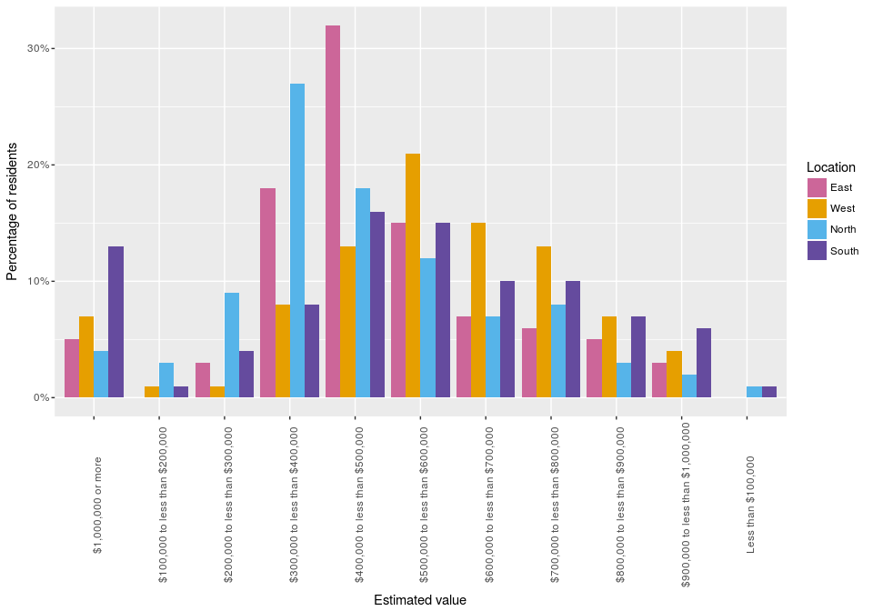

------------------------------------------------------------------------

11. How likely would you be to purchase a new  or land in next five years?

``` r
purchase <- readWorksheet(adelaide, sheet = "Tables_Original", startRow = 2800, endRow = 2803, startCol = 1, endCol = 12, header=FALSE)
names(purchase) <- c("opinion",name[1:11])
purchase_loc <- purchase[,c(1,9:12)]
purchase_loc <- gather(purchase_loc, key = "loc", value = "percent", -c(opinion))

purchase_loc$loc <- factor(purchase_loc$loc, levels=c("East","West","North","South"))

ggplot(purchase_loc,aes(x = loc, y = percent, fill = opinion)) + geom_bar(stat = "identity", position = "dodge") + labs(x = "", y = "Percentage of residents") + scale_y_continuous(labels = scales::percent) + scale_fill_manual(values=c('#CC6699','#E69F00', '#56B4E9', "#654B9E"), name = "Opinion") + theme_minimal()
```

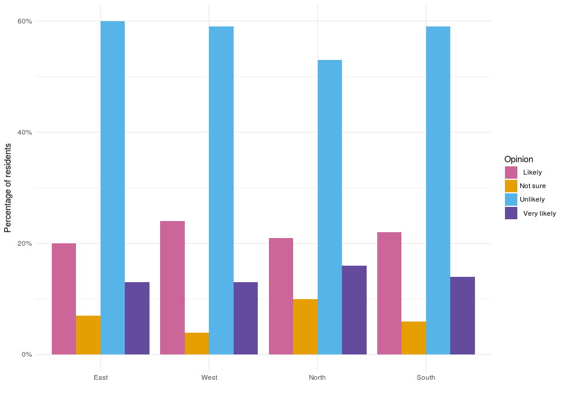

------------------------------------------------------------------------

12. In which of the following areas do you plan to buy this ?

``` r
buy <- readWorksheet(adelaide, sheet = "Tables_Original", startRow = 2839, endRow = 2849, startCol = 1, endCol = 12, header=FALSE)
names(buy) <- c("place",name[1:11])
buy_loc <- buy[,c(1,9:12)]
# Shorten the place names
buy_loc[buy_loc$place == "Adelaide CBD excluding North Adelaide",1] <- "Adelaide CBD"
buy_loc$place <- str_replace_all(buy_loc$place,"urb","")
# Rearrange the places
level <- levels(factor(buy_loc$place))
level <- c(level[1:3],level[6],level[4:5],level[9:10],level[7],level[11],level[8])
buy_loc$place <- factor(buy_loc$place, levels = level)

buy_loc <- gather(buy_loc, key = "loc", value = "percent", -c(place))
buy_loc$loc <- factor(buy_loc$loc, levels=c("East","West","North","South"))

ggplot(buy_loc,aes(x = loc, y = percent, fill = loc)) + geom_bar(stat = "identity") + facet_wrap(~place)+ labs(x = "", y = "Percentage of residents") + scale_y_continuous(labels = scales::percent) + scale_fill_manual(values=c('#CC6699','#E69F00', '#56B4E9', "#654B9E"), name = "Location") + theme(axis.text.x = element_text(angle = 90))
```


------------------------------------------------------------------------

13. What is your  if you were to consider purchasing a new home or land?

``` r
budget <- readWorksheet(adelaide, sheet = "Tables_Original", startRow = 2866, endRow = 2876, startCol = 1, endCol = 12, header=FALSE)
names(budget) <- c("budget",name[1:11])
budget_loc <- budget[,c(1,9:12)]

# Remove % sign
budget_loc <- as.data.frame(sapply(budget_loc, function(x) str_replace(x, "%","")), stringsAsFactors = F)
# Replace - with 0
budget_loc <- as.data.frame(sapply(budget_loc, function(x) str_replace(x, "- ","0")), stringsAsFactors = F)
# Convert the columns into numeric
budget_loc$North <- as.numeric(budget_loc$North)/100
budget_loc$East <- as.numeric(budget_loc$East)/ 100
budget_loc$South <- as.numeric(budget_loc$South)/100
budget_loc$West <- as.numeric(budget_loc$West)

# Make x label short
budget_loc$budget <- str_replace_all(budget_loc$budget, "[Ll]ess than","<")
budget_loc$budget <- str_replace_all(budget_loc$budget, "\\$1,000,000 or more","> $1,000,000")
budget_loc <- gather(budget_loc, key = "loc", value = "percent", -c(budget))
budget_loc$loc <- factor(budget_loc$loc, levels=c("East","West","North","South"))

ggplot(budget_loc, mapping = aes(x = budget, y = percent, fill = loc)) + geom_bar(stat = "identity",position = "dodge") + theme(axis.text.x = element_text(angle = 90)) + labs(x = "Estimated budget", y = "Percentage of residents") + scale_y_continuous(labels = scales::percent) + scale_fill_manual(values=c('#CC6699','#E69F00', '#56B4E9', "#654B9E"), name = "Location")
```

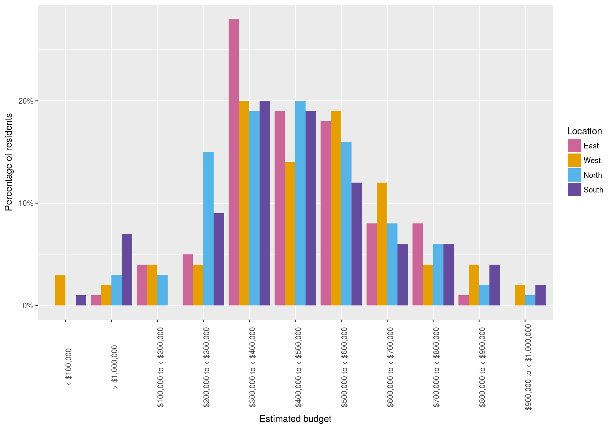

Insights:
---------

#### 1. A **good percentage** of people in **south have over a million dollor**  

#### 2. Most of the people have the  between 300 - 600 thousand dollars.

#### 3. Highest in their groups around 15% of the people in the North and 27% of people in East have  between 200 - 300 and 300 - 400 thousand dollars, respectively.

------------------------------------------------------------------------

14. Adelaide in your view?

``` r
view <- readWorksheet(adelaide, sheet = "Tables_Original", startRow = 1866, endRow = 1882, startCol = 1, endCol = 12, header=FALSE)
names(view) <- c("view",name[1:11])
view_loc <- view[,c(1,9:12)]
# Remove % sign
view_loc <- as.data.frame(sapply(view_loc, function(x) str_replace(x, "%","")), stringsAsFactors = F)
view_loc <- gather(view_loc, key = "loc", value = "percent", -c(view))
view_loc$percent <- as.numeric(view_loc$percent)
view_loc$loc <- factor(view_loc$loc, levels=c("East","West","North","South"))
# Replace big names with small
view_loc[view_loc$view=="An attractive City to buy a home as an investment property",1] <- c("City for investment")
view_loc[view_loc$view=="An attractive City to buy a home in which to live",1] <- c("City to buy home")
ggplot(view_loc,aes(x = loc, y = percent)) + facet_wrap(~ view) + geom_bar(stat = "identity") + labs(x = "", y = "Percentage of residents") + scale_y_continuous(labels = scales::percent) + theme(axis.text.x = element_text(angle = 90))
```

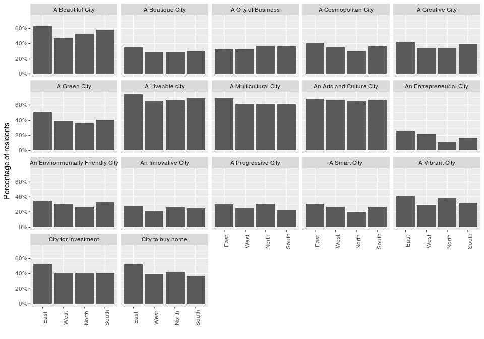

Insights:
---------

#### 1. **Most residents** view Adelaide as a **"liveable, multicultural, cosmopolitan, vibrant, green and beautiful city"** which is full of arts and culture.

#### 2. However, **few people** think Adelaide is a **"smart, progressive and in innovative city"**.

#### 3. Residents in the East are more optimistic about investment and buying home in Adelaide than their peers.

------------------------------------------------------------------------

15. What about climate change?

I don't think Australians are doing enough to combat climate change?
--------------------------------------------------------------------

``` r
climate <- readWorksheet(adelaide, sheet = "Tables_Original", startRow = 2426, endRow = 2429, startCol = 1, endCol = 12, header=FALSE)
names(climate) <- c("opinion",name[1:11])
climate_loc <- climate[,c(1,9:12)]
climate_loc <- gather(climate_loc, key = "loc", value = "percent", -c(opinion))

climate_loc$loc <- factor(climate_loc$loc, levels=c("East","West","North","South"))

ggplot(climate_loc,aes(x = loc, y = percent, fill = opinion)) + geom_bar(stat = "identity", position = "dodge") + labs(x = "", y = "Percentage of residents") + scale_y_continuous(labels = scales::percent) + scale_fill_manual(values=c('#CC6699','#E69F00', '#56B4E9', "#654B9E"), name = "Opinion") + theme_minimal()
```

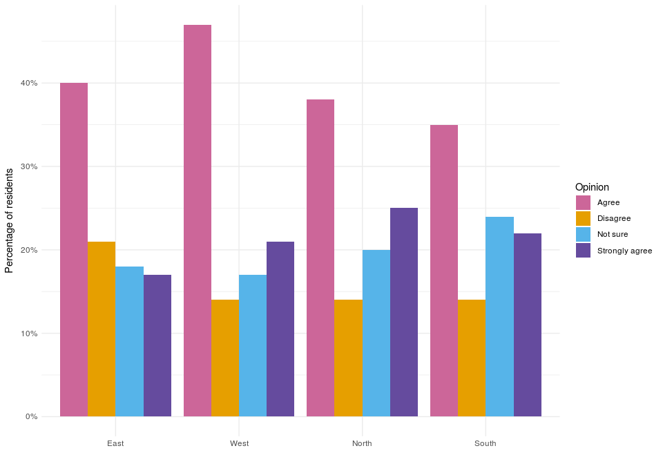

Insights:
---------

#### 1. **Above 60%** of the residents in the **West and North** agree that Australians are not doing enough to combat climate change.

#### 2. Residents in the **East are most skeptical** of the claim that "Australians are not doing enough..."

------------------------------------------------------------------------

16. How about ?

Would you pay more for electricity generated from renewable resources?
----------------------------------------------------------------------

``` r
green <- readWorksheet(adelaide, sheet = "Tables_Original", startRow = 2448, endRow = 2451, startCol = 1, endCol = 12, header=FALSE)
names(green) <- c("opinion",name[1:11])
green_loc <- green[,c(1,9:12)]
green_loc <- gather(green_loc, key = "loc", value = "percent", -c(opinion))

green_loc$loc <- factor(green_loc$loc, levels=c("East","West","North","South"))

ggplot(green_loc,aes(x = loc, y = percent, fill = opinion)) + geom_bar(stat = "identity", position = "dodge") + labs(x = "", y = "Percentage of residents") + scale_y_continuous(labels = scales::percent) + scale_fill_manual(values=c('#CC6699','#E69F00', '#56B4E9', "#654B9E"), name = "Opinion") + theme_minimal()
```

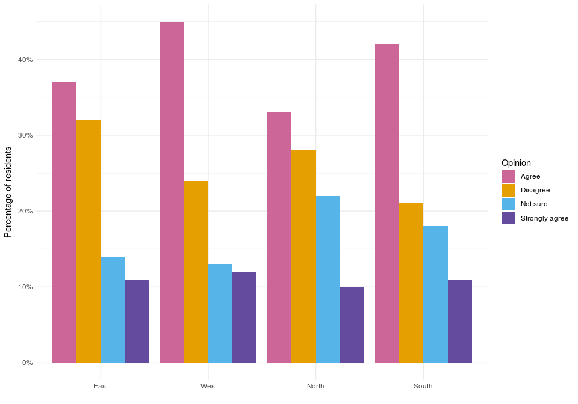

Insights:
---------

#### 1. Residents in the **West and South of Adelaide are more likely to pay higher**  if electricity was generated from renewable resources.

#### 2. Residents in the **North are more reluctant** to pay higher . Although, more than 60% of the residents in the North agree that Australians are not doing enough to combat climate change.

------------------------------------------------------------------------

17. I have travelled a lot around Australia or overseas?

``` r
travel <- readWorksheet(adelaide, sheet = "Tables_Original", startRow = 2536, endRow = 2539, startCol = 1, endCol = 12, header=FALSE)
names(travel) <- c("opinion",name[1:11])
travel_loc <- travel[,c(1,9:12)]
travel_loc <- gather(travel_loc, key = "loc", value = "percent", -c(opinion))

travel_loc$loc <- factor(travel_loc$loc, levels=c("East","West","North","South"))

ggplot(travel_loc,aes(x = loc, y = percent, fill = opinion)) + geom_bar(stat = "identity", position = "dodge") + labs(x = "", y = "Percentage of residents") + scale_y_continuous(labels = scales::percent) + scale_fill_manual(values=c('#CC6699','#E69F00', '#56B4E9', "#654B9E"), name = "Opinion") + theme_minimal()
```

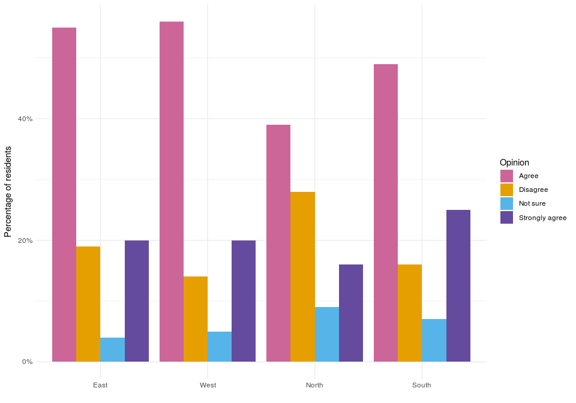

Insights:
---------

#### 1. Residents in the North are much less  than their peers.

------------------------------------------------------------------------

18. Which social media sites do you use at least once a week?

``` r
social <- readWorksheet(adelaide, sheet = "Tables_Original", startRow = 3843, endRow = 3855, startCol = 1, endCol = 12, header=FALSE)
names(social) <- c("site",name[1:11])
social_loc <- social[,c(1,9:12)]
# make site factor 
level <- social_loc$site
social_loc$site <- factor(social_loc$site, levels = level)
social_loc <- gather(social_loc, key = "loc", value = "percent", -c(site))

social_loc$loc <- factor(social_loc$loc, levels = c("East","West","North","South"))

ggplot(social_loc,aes(x = loc, y = percent, fill = loc)) + facet_wrap(~ site) + geom_bar(stat = "identity") + labs(x = "", y = "Percentage of residents") + scale_y_continuous(labels = scales::percent) + theme(axis.text.x = element_text(angle = 90)) + scale_fill_manual(values=c('#CC6699','#E69F00', '#56B4E9', "#654B9E"), name = "Location")
```

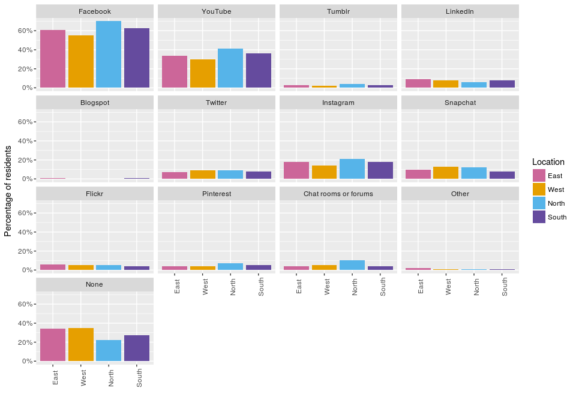

Insights:
---------

#### 1.  is the clear  followed by , , ,  and .

#### 2. People in the **North are more active** on social media sites than others.

#### 3. There are **substantial number** of people who **do not visit social media sites**.
